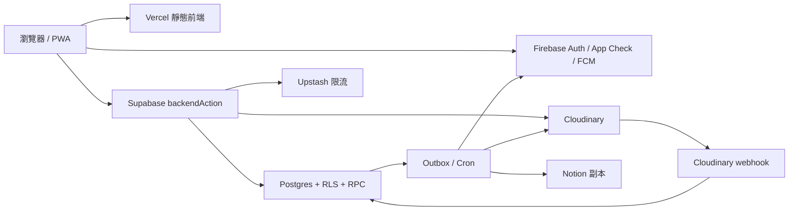

# 系統架構

[English](en/architecture.md) · [文件首頁](README.md)

本頁解釋元件責任、信任邊界與主要資料流。檔案級模組地圖請看 repository 根目錄的 [`structure.md`](../structure.md)。

## 系統概觀

瀏覽器只持有可公開的 Firebase Web 設定與 Supabase publishable key。所有寫入、私密讀取、角色判斷、上傳簽名與外部副作用都在後端完成。

## 技術棧與責任

| 層 | 技術 | 責任 |
| --- | --- | --- |
| Web | Vue 3、TypeScript、Vite、Vue Router、Workbox | UI、路由、PWA、前端流程 |
| 身分 | Firebase Auth、App Check | Google 登入、token 與來源驗證 |
| 推播 | Firebase Cloud Messaging | 個人與 topic Web Push |
| API | Supabase Edge Functions、Deno | 驗證、授權、限流、冪等與 action 分派 |
| 資料 | Postgres、RLS、RPC、Realtime、Cron | 主要資料、交易、權限與排程 |
| 媒體 | Cloudinary | authenticated image 儲存與 delivery |
| 外部副本 | Notion API | 提案與公告的營運副本 |
| 限流 | Upstash Redis REST | 跨執行個體的速率限制 |
| 發布 | GitHub Actions、Vercel、Supabase CLI | 驗證、migration 與部署 |

## 前端模組

| 目錄 | 邊界 |
| --- | --- |
| `views/` | 路由頁組裝與頁面級狀態；不直接讀寫資料 |
| `components/` | 應用 UI 與事件轉發 |
| `components/ui/` | 無業務資料、service 或 session 相依的共用 UI |
| `composables/` | Vue 狀態、生命週期與跨元件流程 |
| `services/` | Edge Function 與 Supabase client 邊界 |
| `lib/` | 不依賴 Vue 的純函式 |
| `types/` | 跨模組型別 |
| `generated/` | 由 JSON 設定產生、應提交的型別化輸出 |

`src/main.ts` 建立應用程式，`App.vue` 管理啟動閘門與 shell，router modules 負責路由與 session guard。業務元件不直接查表或自行拼裝 action。

## 後端入口

| Function | 呼叫者 | 責任 |
| --- | --- | --- |
| `backendAction` | Web App、健康檢查 | 統一驗證、角色、限流、冪等與領域 action |
| `syncUser` | 登入流程 | 同步允許網域使用者與角色 claim |
| `cloudinaryWebhook` | Cloudinary | 驗證 webhook 並更新上傳狀態 |
| `outboxWorker` | Cron／受控觸發 | 通知、FCM、Notion 與外部副作用 |
| `processDeletionJobs` | Cron／受控觸發 | 清除 Cloudinary 資源與同步刪除狀態 |
| `maintenanceCleanup` | 部署／維護者 | 執行資料保留與維護 RPC |

Functions 在 Supabase 設定中關閉內建 JWT 驗證，因為它們使用 Firebase token、webhook signature 或專用 secret 自行驗證。這不是公開匿名存取的意思。

## 資料與授權

- `app_api` 是可由 client 使用的 schema，仍受 RLS 與受控 RPC 保護。
- `app_private` 保存後端流程所需的私有資料與 helper。
- 公開提案資料與作者私密資料分離，避免一般讀取帶出身分。
- 內容交易同時建立 outbox event，外部副作用失敗時可重試。
- Realtime event 依公開、作者或管理員受眾授權。
- Dashboard 使用交易內 counters 與聚合資料，避免每次掃描主要內容表。

## 主要流程

### 登入

1. 瀏覽器透過 Firebase Google provider 登入。
2. 前端取得 Firebase ID token 並呼叫 `syncUser`。
3. 後端驗證 token、email 驗證狀態與允許網域。
4. 後端同步使用者與角色；後續 action 再次驗證，不信任前端角色。

### 圖片

1. 瀏覽器驗證尺寸並壓縮為 WebP。
2. `backendAction` 驗證權限與額度，建立簽名上傳 session。
3. 瀏覽器直傳 Cloudinary authenticated resource。
4. Webhook 將 metadata 標記為 ready 或 failed。
5. Markdown 只儲存 `srp-upload://<id>`；讀取時批次換成短效 signed URL。
6. 未使用、失敗或已刪除資源由 deletion job 清理。

### 通知與外部同步

1. 內容交易建立 outbox event。
2. Worker claim 待處理事件，避免多個 worker 重複處理。
3. 事件建立站內通知、FCM 訊息或 Notion 更新。
4. 可重試失敗保留追蹤資訊；完整錯誤只留在 Function logs。

## 部署拓樸

`main` 對應 GitHub `production` Environment，`dev` 對應 `development`。後端 workflow 先推 migrations、設定 secrets、部署 Functions 並 smoke test；前端 workflow 建置並部署 Vercel artifacts。若同一 commit 同時改到後端與前端，前端工作會等待相符的後端部署完成。

## 架構約束

`tests/architecture.test.mjs` 防止私密設定進入前端、敏感資料繞過後端、分頁不穩定、圖片未驗證、通知越權及部署責任混雜。修改資料流時，除了單元行為也要更新這些靜態約束與本文件。
