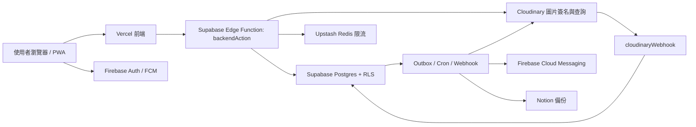

# 技術架構

本專案採用前端靜態部署、Supabase 後端資料與 Edge Functions、Firebase 身份驗證、Cloudinary 圖片儲存、Notion 備份與 Upstash Redis 限流的組合。核心原則是：前端不直接處理敏感流程，所有寫入與敏感讀取都走受控後端 action。

## 技術棧

| 層級 | 技術 |
| --- | --- |
| 前端 | Vue 3、Vite、TypeScript、Vue Router、Tailwind、PWA / Workbox |
| 身份 | Firebase Authentication、Firebase App Check、Firebase Cloud Messaging |
| 後端 | Supabase Edge Functions、Deno、Supabase JS |
| 資料庫 | Supabase Postgres、RLS、RPC、Trigger、Realtime、Cron |
| 圖片 | Cloudinary authenticated upload、signed delivery URL、前端 WebP 壓縮 |
| 背景工作 | Supabase Edge Functions、outbox、maintenance cleanup |
| 備份同步 | Notion API |
| 限流 | Upstash Redis REST |
| 部署 | GitHub Actions、Vercel、Supabase CLI |
| 驗證 | vue-tsc、ESLint、Vite build、Deno check、Node test runner、架構測試 |

## 高階資料流

## 前端分層

| 目錄 | 責任 |
| --- | --- |
| `views/` | 路由頁面組裝與頁面級狀態 |
| `components/` | 應用 UI 與事件轉發 |
| `components/ui/` | 無業務資料來源的共用 UI |
| `composables/` | Vue 狀態、生命週期、流程協調 |
| `services/` | Supabase Edge Function / Supabase client 邊界 |
| `lib/` | 無 Vue 相依的純函式 |
| `types/` | 跨模組核心型別 |
| `generated/` | 由 config 產生的型別化設定 |

前端只使用 `VITE_*` 公開環境變數。管理員名單、service role key、資料庫密碼、第三方 API secret 與 webhook secret 不會進入前端 bundle。

## 後端 Edge Functions

| Function | 責任 |
| --- | --- |
| `backendAction` | 前端受控 action 入口，集中 CORS、Firebase 驗證、角色查詢、冪等與分派 |
| `syncUser` | Firebase 登入後同步使用者角色與 custom claim |
| `cloudinaryWebhook` | 驗證 Cloudinary 上傳完成通知，將圖片狀態轉為 ready 或 failed |
| `outboxWorker` | 處理通知、推播、Notion 同步與外部副作用 |
| `processDeletionJobs` | 處理 Cloudinary / Notion 清理工作 |
| `maintenanceCleanup` | 手動維護入口，呼叫資料庫清理 RPC |

`backendAction` 是前端主要後端入口，避免元件直接組 SQL 或自行呼叫敏感資料表。

## 資料庫設計重點

- `app_api` schema：前端 Supabase client 可見的 API schema，仍受 RLS 保護。
- `app_private` schema：service role Edge Functions 使用的私有 schema。
- RLS：保護提案、留言、通知、角色與私密作者資料。
- Trigger / outbox：內容異動與副作用事件在同一交易中建立，降低同步漏失。
- RPC：提供清理、維護、聚合統計與受控資料操作。
- Realtime：通知使用共享訂閱與 recipient 過濾；內容事件依公開、作者或管理員受眾授權，並以計數增量更新避免重讀整頁。

## 圖片流程

1. 前端選圖後壓縮為 WebP。
2. 前端向 `backendAction` 取得 Cloudinary signed upload session。
3. 圖片直傳 Cloudinary authenticated resource。
4. Cloudinary webhook 通知後端圖片完成。
5. 內容正文只保存 `srp-upload://<id>`。
6. 顯示時由後端批次換成 signed delivery URL。
7. 刪除或失敗圖片由 deletion jobs 清理。

這個流程避免公開原始 Cloudinary API secret，也讓圖片 URL 可以過期與重新簽名。

## 通知流程

1. 提案、公告、留言、附議達標或狀態變更建立 outbox event；一般附議計數只走 Realtime，不逐次啟動背景同步。
2. `outboxWorker` claim pending events。
3. 依事件類型建立 App 內通知。
4. 依使用者推播偏好送出 FCM Web Push。
5. 同步 Notion 或建立外部清理工作。
6. 成功事件採短期保留或不落地；失敗只回寫追蹤碼，完整錯誤留在 Function logs 供 Dashboard 追查。

## 部署流程

- `Deploy Supabase Backend`：檢查架構、link Supabase、推送 migrations、設定 Edge Function secrets、部署 functions、做健康檢查。
- `Deploy Frontend to Vercel`：檢查前端部署 secrets、拉 Vercel project info、執行 Vercel build、部署 prebuilt artifacts。
- `Verify PR`：跑型別、lint、build、架構測試與 audit。
- Reset workflows：只供維護使用，正式環境需謹慎。

## 架構測試

`tests/architecture.test.mjs` 用來防止高風險架構回歸，例如：

- 前端誤放 Firebase Admin 或 service role 類設定。
- Vercel workflow 混入後端部署責任。
- Supabase backend workflow 沒有設定必要私密值。
- webhook、outbox、FCM、Notion 或圖片流程缺少防護。
- 通知與私密資料讀取繞過受控後端流程。

## 設計取捨

- 使用 Firebase Auth 而不是 Supabase Auth：方便校內 Google 登入、FCM 與 App Check 整合。
- 使用 Supabase 承接資料與後端流程：RLS、Edge Functions、Postgres、Realtime 與 Cron 集中。
- 使用 Cloudinary 而不是 Supabase Storage：支援 authenticated delivery、轉檔與媒體管理。
- 使用 Notion 作為備份視圖：方便非工程管理員追蹤內容，但不作為主資料庫。
- 使用 Upstash REST：適合 serverless Edge Function 的短請求限流。
