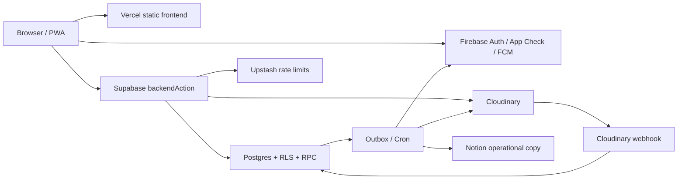

# Architecture

[繁體中文](../architecture.md) · [Documentation home](../README.md)

This page explains component ownership, trust boundaries, and primary data flows. See [`structure.md`](../../structure.md) for the file-level module map.

## System overview

The browser only receives public Firebase Web configuration and the Supabase publishable key. Writes, private reads, role decisions, upload signatures, and external side effects run on the backend.

## Technology and ownership

| Layer | Technology | Responsibility |
| --- | --- | --- |
| Web | Vue 3, TypeScript, Vite, Vue Router, Workbox | UI, routing, PWA, client workflows |
| Identity | Firebase Auth, App Check | Google sign-in, tokens, origin attestation |
| Push | Firebase Cloud Messaging | Personal and topic-based Web Push |
| API | Supabase Edge Functions, Deno | Authentication, authorization, rate limits, idempotency, dispatch |
| Data | Postgres, RLS, RPC, Realtime, Cron | Source of truth, transactions, policy, scheduling |
| Media | Cloudinary | Authenticated image storage and delivery |
| Copy | Notion API | Operational proposal and announcement copy |
| Limits | Upstash Redis REST | Cross-instance rate limiting |
| Delivery | GitHub Actions, Vercel, Supabase CLI | Verification, migrations, deployment |

## Frontend boundaries

`views/` assembles routes, `components/` renders application UI, `components/ui/` stays business-agnostic, `composables/` coordinates Vue workflows, `services/` owns remote boundaries, `lib/` contains Vue-independent utilities, and `types/` owns shared contracts. `AppShell` owns the desktop sidebar, mobile bottom navigation, route-wide content clearance, and shared create entry. Business components do not query tables or construct sensitive actions directly.

## Backend functions

| Function | Responsibility |
| --- | --- |
| `backendAction` | Unified client gateway for auth, roles, limits, idempotency, and domain actions |
| `syncUser` | Synchronizes allowed-domain users and role claims after sign-in |
| `cloudinaryWebhook` | Verifies upload callbacks and updates image state |
| `outboxWorker` | Processes notifications, FCM, Notion, and other side effects |
| `processDeletionJobs` | Removes Cloudinary resources and synchronizes deletion state |
| `maintenanceCleanup` | Runs retention and maintenance RPCs |

Supabase's built-in JWT check is disabled for these functions because they validate Firebase tokens, webhook signatures, or dedicated secrets themselves. This does not mean the endpoints are anonymously authorized.

## Data and authorization

- `app_api` is client-visible but protected by RLS and controlled RPCs.
- `app_private` stores backend-only data and helpers.
- Public proposal records are separated from private author data.
- Transactions create outbox events alongside content changes.
- Realtime audiences are authorized for public, author, recipient, or admin access. Lists and comments reconnect and re-fetch after channel failures and periodically reconcile while visible. Selecting the active desktop sidebar item or mobile bottom navigation item refreshes proposal and announcement lists manually.
- Dashboard counters and aggregates avoid scanning primary content on each visit.

## Key flows

### Sign-in

The browser signs in with Firebase Google Auth, sends an ID token to `syncUser`, and the backend validates signature, project, verified email, and allowed domain. Every later action repeats backend authorization; client role state is never authoritative.

### Images

The browser compresses to WebP, obtains an authorized upload session, and uploads directly to an authenticated Cloudinary resource. A verified webhook marks the upload ready. Markdown stores only `srp-upload://<id>`, resolved in batches to expiring signed URLs. Deletion jobs remove failed, unused, or deleted resources.

### Notifications and synchronization

A content transaction creates an outbox event. A worker claims pending work and creates in-app notifications, FCM messages, or Notion updates. Retryable failures retain tracking data while detailed errors remain in provider logs.

## Deployment topology

`main` uses the GitHub `production` Environment and `dev` uses `development`. The backend workflow applies migrations, sets secrets, deploys functions, and runs a smoke test. The frontend workflow builds and deploys Vercel artifacts. A frontend deployment waits for the matching backend run when one commit changes both layers.

Architecture regressions are enforced by `tests/architecture.test.mjs`, including secret boundaries, authorization paths, stable pagination, upload validation, notification scope, and deployment ownership.
